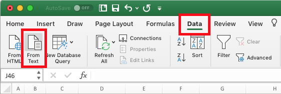
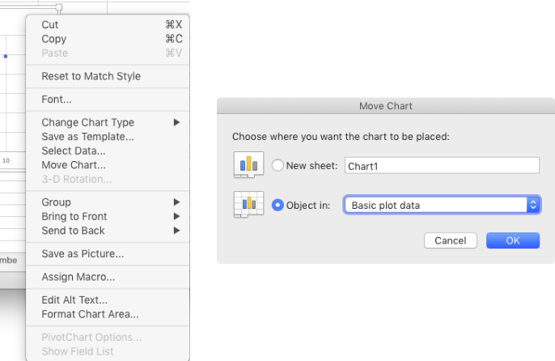

# An Introduction to Data Analysis and Plotting with MS Excel #

Purpose
:
The goal of this exercise is to familiarize the student with basic data manipulation and plotting using Microsoft Excel 2016. Many of the concepts are general and can be translated to other software applications. By the end of this exercise, you should be able to 

: 
- perform basic manipulations on data columns (formatting, transformations)
- perform simple mathematical operations over a column of data 
- plot columns of data in a clear and visually pleasing manner
- perform simple statistical operations on a set of data
- get a line-of-best-fit for multiple datasets
- import data from plain text files (CSV, TSV, DAT, etc.), like those created by many spectrometers and logging instruments

Why do we plot data? Edward Tufte may have said it best: 

> At their best, graphics are instruments for reasoning about quantitative information. Often the most effective way to describe, explore, and summarize a set of numbers -- even a very large set -- is to look at pictures of those numbers.

## A little bit about plots ##

Plots (also called graphs or charts, though these are not *quite* the same thing) come in a variety of styles. The can be used to explore data as your are performing analyses or to convey results to a reader as part of a report. There are a variety of "standard" types which should cover your needs in this course. The main types we will use are:

- Scatter plot
	- Used to show correlation between two variables, each point generally represents an independent measurement. 
	- Points are *not* connected by lines. Lines are only used to represent a mathematical fit of the data. 
- Line graph
	- Indicates continuity in the *x*-axis, often suggests single collection for everything on the "line".
	- Really just a special case of scatter plot where the independent variable is continuous. 
- Histogram
	- Represents the distribution of data in a series of "bins", shows frequency of measurement events. Closely related to density plots.

Here are the important parts of a plot, along with a brief description and guidelines for formatting. 

Title
:
Should be descriptive and represent _all_ data in the plot. 

Axes
:
Should be clearly labeled (category, units, tick numbers). Should have an appropriate range (from slightly less than your minimum value to slightly more than your maximum value). 

Fit line
: 
Should cover the whole spread of the data, but should not predict beyond the data range (you don't know anything about measurements in that region). 

Legend
:
Should clearly show which set of data is which, trend lines should clearly correlate to a given data set. 

## Basic Plotting and Linear Fits ##

Your first task is to take the data in the file `data.txt` and import it into a new Excel workbook. Begin by downloading the input files from the "Plotting" folder on Blackboard. This folder contains a few datasets in some plaintext formats. The file extension doesn't always tell you what type of information is in a file and can sometimes lead you astray. For this exercise, the file `data.txt` contains a set of "tab-delimited" data, meaning that the values in a row are separated by tab characters. Another common format is "comma-delimited" or "comma-separated" data, such as the dataset in `anscombe.csv`. You will find that different instruments have different defaults for exporting data, but these two are the most common. 

Open up a new Excel workbook and save it to a safe location (if this is a lab computer, your best bet is to save directly to your own flash drive). In the workbook, pull in the data from `data.txt` by selecting  the "Data" tab in the Ribbon and clicking on "From Text". On a Mac, you can also select "File → Import" in the menu bar. 

Follow the prompts to import data which is tab-separated into the first rows in your spreadsheet. You should end up with two columns of data with 21 data points in each column. Once you have the data columns, create a new scatter plot from the data. This is done by clicking on the "Insert" tab and selecting the correct type of chart.[^defaults] When you insert a new plot, it appears as a floating object in your current sheet. While you are exploring data, this is fine, but you'll probably want to move these objects to their own sheet when you really start customizing their appearance. You can do this by right-clicking on the plot background and selecting "Move Chart…". This will bring up a window where you can choose to move the chart to its own new sheet or as an object in another existing sheet. 

Move the chart to a new sheet (name the sheet X vs. Y) and fill in the fundamental plot items (descriptive title, axes title, etc.). Once this is complete, remove any unnecessary "chart junk". This includes things like background shading (Excel has gotten much better at this over the years), grid lines (only needed if you're trying to manually read data off the chart), and the border surrounding the full plot area (should only need axes to indicate the origin or provide an anchor for tick marks). If there is a legend (useful when there are multiple datasets present), it should be a part of the plot area. Don't waste valuable area on something like a legend than can be nestled in one of the empty parts of your plot. Finally, while color seems like a nice feature, plots shouldn't rely on color to convey meaning. There's always a chance that readers wont' have access to color printouts or that the reader may be colorblind. To keep plots accessible, use symbols, line weights, and dashing to differentiate your datasets. The lesson to learn from this paragraph is that simplicity is key to conveying your message. The sole purpose of your figures are to help the reader understand the message. Anything that distracts from that is harmful to your cause. 

Now that the plot has been cleaned up, adjust the axes to best represent the data and insert a trendline (right-click, "Add Trendline…"). A linear fit should be sufficient for this data. In the format options for the trendline, display the equation and R^2 value on the plot. Move them so that they don't obscure any of the plot data. 

### The LINEST function ###

Now that you have a trendline, it's time to get some information about it. Excel has a function called [`LINEST`][linest], which calculates descriptive statistics on a line using a linear least-squares method to find the best fit. Examples can be seen on the linked page, but we will run through the simplest example, a straight line. 

Return to your data spreadsheet and highlight a 2x5 grid of cells (the cells directly under or adjacent to your dataset will do). Begin typing the following (your keystrokes will automatically go into the upper left cell):

	=linest(

Excel will pop up a hint telling you what information needs to be entered next. The first range should be your *y*-values (cell B2 through B22), the second range is your *x*-values (A2 through A22). The third and fourth arguments are optional. Setting the third argument to `TRUE` will tell the function to calculate a *y*-intercept value, while an entry of `FALSE` will set the intercept equal to zero. The fourth argument toggles additional regression statistics using `TRUE` or `FALSE`. These help you to see how "good" the returned fit is. Please read the help page to learn what statistics are returned in which cell. When you have finished entering your data into the cell, press <kbd>Shift</kbd> + <kbd>Ctrl</kbd> + <kbd>Enter</kbd> to tell Excel to calculate all data in the array. Note that the numbers in the first row of the array correspond to the slope and intercept of the trendline in your plot. 

## Anscombe's Quartet ##

Repeat the process of importing data with the file `anscombe.csv`. You will need to change the delimiter to a comma for this file. This time, import the data into a new sheet called "Anscombe". You should see 8 columns of data, x1–x4 and y1–y4. Begin by calculating `LINEST` arrays for each x/y pair. For clarity, you should label each array using a cell just above the array, like so: 

Once you have four arrays, compare the values… do you notice anything odd? Remember, the top two cells represent the slope and intercept of a line of best fit for the data. It might help to format the cells to only display three decimal places (highlight the cells, right-click, "Format Cells…", then select 3 decimal places under the Number data type). 

Clearly, the data sets are different… so what's going on? To learn more, plot each of the datasets in a separate plot. Discuss your observations with your lab partner, and figure out the best way to deal with information like this. The key takeaway from this exercise is that you should always plot your data, even if it's only a quick glance on the side of your spreadsheet! This data was taken from [an article written by F.J. Anscombe in 1973][anscombe] arguing for the necessity of graphs in statistical analysis. 

## Column Transformation/Manipulation and Plotting Spectra ##

From the set of input files you downloaded from Blackboard, open the file labeled `FTIR_UVVis_template.xltx`. Copy the data from the FTIR sheet and paste it into your plotting document in a new sheet called “FTIR”. Once you have this data in a sheet, insert a new row at the top of the data (for column labels) and a new column between columns A and B. Label column A “Wavenumber (cm^{-1}), column B as “Wavelength (µm)”, column C as “% Transmission”, and column D as “Absorbance”.[^units] 

You will be automatically filling in values for columns B and D based on the data in A and C. Click on cell B2 and enter the following:
	
	=1/(A2/10^(-2))*10^(6)

This is a conversion from wavenumber to wavelength. You should be able to derive this equation quickly on your own… 

Click on cell B2. You can perform this next step in two ways. First, you can copy cell B2, select the the whole range of cells below it (through B1766), and paste. This will fill the range with a stepped version of the equation you just typed (A2 will be stepped in each cell until it reaches A1766). You can also select cell B2 and click and hold on the small square that appears at the bottom right corner of the cell. While holding down the mouse button, drag your selection down until you reach the bottom of the range (B1766). For short selections (<50 cells) this can be convenient. For larger selections, it is often easier to select the range using the <kbd>Shift</kbd> key. 

Perform the same sets to take the values in column C and transform them into Absorbance values in column D. Remember that Absorbance is \\(\log_{10}(1/T)\\) while Transmittance is \\(I / I_0\\). 

Once you have created columns B and D, create two plots, one containing columns A and C, the second plotting B and D. Because these are spectra (data collected in a single experiment), it is appropriate to plot them as line plots, without plotting the individual points. Make sure that your plot reflects this. You will also need to decrease the thickness of the default line so that fine features are not obscured by poor plot formatting (as I said, Excel’s defaults are often inappropriate). Make sure your plots are labeled in all the appropriate locations and that your spectra look clean and presentable. 

Congratulations, you have the basics of plotting and calculation using Excel! We expect you to take this information and build upon it as you write reports through the semester. All of these techniques can be translated to other applications, some of which might be more appropriate for the type of research being performed in your group. You should be able to transfer your basic skills to any other software with ease and the tips on presentability are universally applicable. 

## Alternative Software ##

Excel may be the most common piece of software for plotting, but that doesn't mean it's the best. You may find that you desire more control over your plots, or a simpler interface, or the ability to manipulate your data in other manners. If so, you might want to look at the following applications. Some are free, some are available through a CUNY site license, and some are paid (and expensive). this is not comprehensive, but it does give you an idea of the variety available to you should you be interested. 

- [LibreOffice Calc][lo_calc] (Free): Part of the free and open source LibreOffice suite, designed as a full featured alternative to Microsoft Office. 
- [Apple Numbers][numbers] (Free): Apple's entry into the spreadsheet category. Works almost as well as Excel, cleaner interface, but macOS/iOS-only and can't always do more advanced statistics. 
- [Google Sheets][sheets] (Free): Like all Google products, this is web-only (no offline data analysis here!). Designed to be a clone of Excel. 
- [GraphPad Prism][prism] (site license): Statistical analysis software for Windows and macOS. Capable of repeated analysis on huge datasets of life/social science data. Falls short in spectral analysis tools. 
- [Origin by OriginLab][origin] (no site license available): Professional data analysis and plotting software for scientists and engineers. Heavy focus on physical sciences and engineering. Only available on Windows. (no site license available)
- [Igor Pro by WaveMetrics][igor] (no site license available): Very similar to Origin, but available for macOS and Windows. 
- [Mathematica][mathematica](site license), [Matlab][matlab](site license), [JupyterLab][jupyter](free): These are really programming environments, though they are designed for use by scientists. Mathematica and Matlab are commercial products, Jupyter is an open-source option that uses the [JUlia][julia], [PYThon][python], and [R][rstat] languages. They all have entry-output interfaces so that live interaction can be done with data. While the learning curve is steep, the payout for learning a programming language will last a lifetime. We will be using the Python later in the semester for some computational chemistry work. 

[^defaults]: *n.b.:* Excel is designed primarily as a tool for finance and business operations. The default settings for plots are often inappropriate for scientific plots, and the "Recommended Charts" button will rarely give you an appropriate suggestion for a plot.

[^units]: What are the relevant units for %T and A?

[linest]: https://support.office.com/en-us/article/LINEST-function-84D7D0D9-6E50-4101-977A-FA7ABF772B6D
[anscombe]: https://doi.org/10.1080/00031305.1973.10478966

[lo_calc]: https://www.libreoffice.org/discover/calc/
[numbers]: https://www.apple.com/numbers/
[sheets]: https://docs.google.com/spreadsheets/
[prism]: https://www.graphpad.com
[origin]: https://www.originlab.com
[igor]: https://www.wavemetrics.com/products/igorpro
[mathematica]: http://www.wolfram.com/mathematica/
[matlab]: https://www.mathworks.com/products/matlab.html
[jupyter]: https://jupyter.org
[julia]: https://julialang.org
[python]: https://www.python.org
[rstat]: https://www.r-project.org
